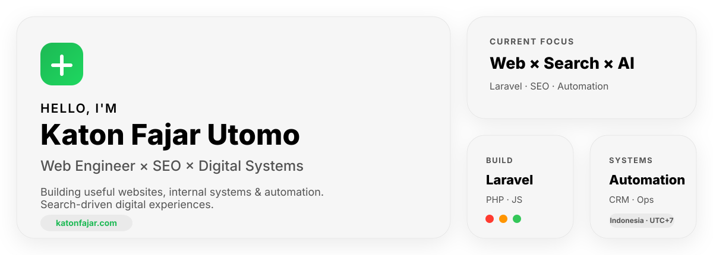

<!--
  GitHub Profile README for Katon Fajar Utomo
  Repository: katonfajar123/katonfajar123
-->

<picture>
  <source media="(prefers-color-scheme: dark)" srcset="./assets/header-bento-dark.svg">
  <source media="(prefers-color-scheme: light)" srcset="./assets/header-bento-light.svg">
  
</picture>

 

 

<!-- Contribution snake intentionally placed directly below identity -->

<picture>
  <source media="(prefers-color-scheme: dark)" srcset="https://raw.githubusercontent.com/katonfajar123/katonfajar123/output/github-snake-dark.svg">
  <source media="(prefers-color-scheme: light)" srcset="https://raw.githubusercontent.com/katonfajar123/katonfajar123/output/github-snake.svg">
  
</picture>

 

<!-- Contribution activity graph -->

<picture>
  <source media="(prefers-color-scheme: dark)" srcset="https://github-readme-activity-graph.vercel.app/graph?username=katonfajar123&bg_color=0D1117&color=8B949E&line=58A6FF&point=F0F6FC&area=true&area_color=1F6FEB&hide_border=true&radius=16&custom_title=Contribution%20Activity">
  <source media="(prefers-color-scheme: light)" srcset="https://github-readme-activity-graph.vercel.app/graph?username=katonfajar123&bg_color=FFFFFF&color=6B7280&line=0A84FF&point=111827&area=true&area_color=DCEEFF&hide_border=true&radius=16&custom_title=Contribution%20Activity">
  
</picture>

 

About Me

I'm a Web Engineer focused on building modern websites, internal systems, web applications, automation, and search-driven digital experiences.

I enjoy working at the intersection of Web Engineering × SEO × AI Automation, turning business requirements into systems that are useful, maintainable, measurable, and pleasant to use.

Building websites, internal systems, and custom web applications

Working with Laravel, PHP, JavaScript, MySQL, and WordPress

Connecting SEO, analytics, automation, and technical implementation

Exploring practical AI-assisted workflows and system automation

I like digital products that do more than look good. They should solve a real problem, reduce friction, and make the next step obvious.

What I Build

<table>
  <tr>
    <td width="50%" valign="top">
      <h3>Modern Websites</h3>
      
Fast, structured, responsive websites built around content, performance, usability, and search visibility.

    </td>
    <td width="50%" valign="top">
      <h3>Internal Systems</h3>
      
Operational tools, CRM workflows, dashboards, admin systems, and business-specific digital processes.

    </td>
  </tr>
  <tr>
    <td width="50%" valign="top">
      <h3>Web Applications</h3>
      
Custom applications with structured data, authentication, workflows, integrations, and maintainable interfaces.

    </td>
    <td width="50%" valign="top">
      <h3>Automation & Search</h3>
      
Technical SEO, analytics, AI-assisted workflows, validation, integrations, and repetitive-task reduction.

    </td>
  </tr>
</table>

Working Stack

<table>
  <tr>
    <td width="18%"><strong>BUILD</strong></td>
    <td>
      
       
      Laravel · PHP · JavaScript · MySQL
    </td>
  </tr>
  <tr>
    <td><strong>DESIGN</strong></td>
    <td>
      
       
      Figma · Illustrator · Photoshop
    </td>
  </tr>
  <tr>
    <td><strong>VISIBILITY</strong></td>
    <td>
      
      
      
      
       
      SEMrush · Search Console · Analytics · WordPress
    </td>
  </tr>
  <tr>
    <td><strong>OPS</strong></td>
    <td>
      
      
       
      GitHub · Cloudflare · Google Cloud · Oracle
    </td>
  </tr>
</table>

Selected Work

<table>
  <tr>
    <td width="50%" valign="top">
      <h3><a href="https://crm.rooma21.com">Rooma21 CRM</a></h3>
      
<strong>Internal System · CRM · Property Pipeline</strong>

      
Centralized lead management and operational workflows built around the needs of a real-estate business.

      <code>Laravel</code> <code>CRM</code> <code>Automation</code>
    </td>
    <td width="50%" valign="top">
      <h3><a href="https://katonfajar.com/id/proyek">InixCert</a></h3>
      
<strong>Digital Certificate Management</strong>

      
A Laravel-based certificate management workflow designed to make certificate publishing and administration more structured.

      <code>Laravel</code> <code>Workflow</code> <code>Testing</code>
    </td>
  </tr>
  <tr>
    <td width="50%" valign="top">
      <h3><a href="https://rooma21.com/v2">Rooma21 Portal</a></h3>
      
<strong>Property Platform · Content & Data</strong>

      
A property portal ecosystem combining listings, structured area content, operational data, and publishing workflows.

      <code>Laravel</code> <code>Portal</code> <code>SEO</code>
    </td>
    <td width="50%" valign="top">
      <h3><a href="https://katonfajar.com/id/proyek">Automation & Digital Workflow</a></h3>
      
<strong>Process Automation · Integrations</strong>

      
Practical automation for validation, system integration, repetitive work reduction, and cleaner operational handoffs.

      <code>Automation</code> <code>API</code> <code>AI</code>
    </td>
  </tr>
</table>

  <a href="https://katonfajar.com/id/proyek"><strong>View more projects →</strong></a>

 

<strong>Building useful things for the web.</strong>

  

<a href="https://katonfajar.com/id">katonfajar.com</a>

 

Web Engineering · SEO · Automation · Digital Systems

