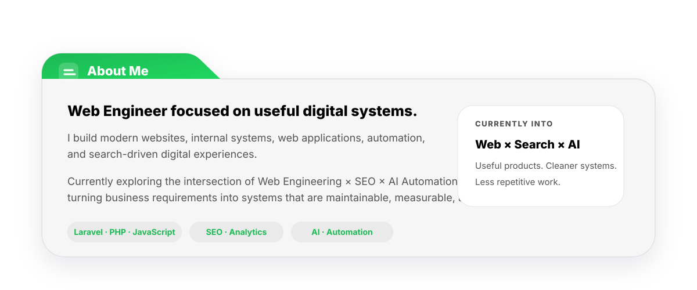

<!--
  GitHub Profile README
  Katon Fajar Utomo
  Repository: katonfajar123/katonfajar123
-->

<!-- ===================================================== -->
<!-- HEADER                                                -->
<!-- ===================================================== -->

<picture>
  <source media="(prefers-color-scheme: dark)" srcset="assets/header-bento-dark.svg">
  <source media="(prefers-color-scheme: light)" srcset="assets/header-bento-light.svg">
  
</picture>

 

<!-- ===================================================== -->
<!-- SOCIAL LINKS                                          -->
<!-- ===================================================== -->

 

<!-- ===================================================== -->
<!-- CONTRIBUTION SNAKE                                    -->
<!-- ===================================================== -->

### Contribution Snake

<picture>
  <source media="(prefers-color-scheme: dark)" srcset="https://raw.githubusercontent.com/katonfajar123/katonfajar123/output/github-snake-dark.svg">
  <source media="(prefers-color-scheme: light)" srcset="https://raw.githubusercontent.com/katonfajar123/katonfajar123/output/github-snake.svg">
  
</picture>

 

<!-- ===================================================== -->
<!-- CONTRIBUTION GRAPH                                    -->
<!-- ===================================================== -->

### Contribution Activity

 

<!-- ===================================================== -->
<!-- ABOUT ME                                              -->
<!-- ===================================================== -->

<picture>
  <source media="(prefers-color-scheme: dark)" srcset="assets/about-folder-dark.svg">
  <source media="(prefers-color-scheme: light)" srcset="assets/about-folder-light.svg">
  
</picture>

 

> **My approach:** Build digital products that solve real problems, reduce repetitive work, and make the next step obvious.

 

<!-- ===================================================== -->
<!-- WHAT I BUILD                                          -->
<!-- ===================================================== -->

## What I Build

<table>
<tr>

<td width="50%" valign="top">

<h3>🌐 Modern Websites</h3>

Fast, structured, responsive websites built around
content, performance, usability, and search visibility.

<code>Website</code>
<code>SEO</code>
<code>Performance</code>

</td>

<td width="50%" valign="top">

<h3>⚙️ Internal Systems</h3>

Operational tools, CRM workflows, dashboards,
admin systems, and business-specific digital processes.

<code>CRM</code>
<code>Dashboard</code>
<code>Workflow</code>

</td>

</tr>

<tr>

<td width="50%" valign="top">

<h3>📱 Web Applications</h3>

Custom applications with structured data,
authentication, workflows, integrations,
and maintainable interfaces.

<code>Laravel</code>
<code>MySQL</code>
<code>API</code>

</td>

<td width="50%" valign="top">

<h3>🤖 Automation & Search</h3>

Technical SEO, analytics, AI-assisted workflows,
validation, integrations, and repetitive-task reduction.

<code>Automation</code>
<code>SEO</code>
<code>AI</code>

</td>

</tr>
</table>

 

<!-- ===================================================== -->
<!-- WORKING STACK                                         -->
<!-- ===================================================== -->

## Working Stack

### BUILD

`Laravel` `PHP` `JavaScript` `MySQL`

---

### DESIGN

`Figma` `Illustrator` `Photoshop`

---

### VISIBILITY

`SEMrush` `Search Console` `Analytics` `WordPress`

---

### OPS

`GitHub` `Cloudflare` `Google Cloud` `Oracle`

 

<!-- ===================================================== -->
<!-- SELECTED WORK                                         -->
<!-- ===================================================== -->

## Selected Work

<table>
<tr>

<td width="50%" valign="top">

<h3>
<a href="https://crm.rooma21.com">
Rooma21 CRM
</a>
</h3>

<strong>Internal System · CRM · Property Pipeline</strong>

Centralized lead management and operational workflows
built around the needs of a real-estate business.

<code>Laravel</code>
<code>CRM</code>
<code>Automation</code>

</td>

<td width="50%" valign="top">

<h3>
<a href="https://katonfajar.com/id/proyek">
InixCert
</a>
</h3>

<strong>Digital Certificate Management</strong>

A Laravel-based certificate management workflow designed
to make certificate publishing and administration more structured.

<code>Laravel</code>
<code>Workflow</code>
<code>Testing</code>

</td>

</tr>

<tr>

<td width="50%" valign="top">

<h3>
<a href="https://rooma21.com/v2">
Rooma21 Portal
</a>
</h3>

<strong>Property Platform · Content & Data</strong>

A property portal ecosystem combining listings,
structured area content, operational data,
and publishing workflows.

<code>Laravel</code>
<code>Portal</code>
<code>SEO</code>

</td>

<td width="50%" valign="top">

<h3>
<a href="https://katonfajar.com/id/proyek">
Automation & Digital Workflow
</a>
</h3>

<strong>Process Automation · Integrations</strong>

Practical automation for validation, system integration,
repetitive work reduction, and cleaner operational handoffs.

<code>Automation</code>
<code>API</code>
<code>AI</code>

</td>

</tr>
</table>

 

<a href="https://katonfajar.com/id/proyek">
<strong>View more projects →</strong>
</a>

 
 

<!-- ===================================================== -->
<!-- FOOTER                                                -->
<!-- ===================================================== -->

<h3>Building useful things for the web.</h3>

<a href="https://katonfajar.com/id">
<strong>katonfajar.com</strong>
</a>

Web Engineering · SEO · Automation · Digital Systems

